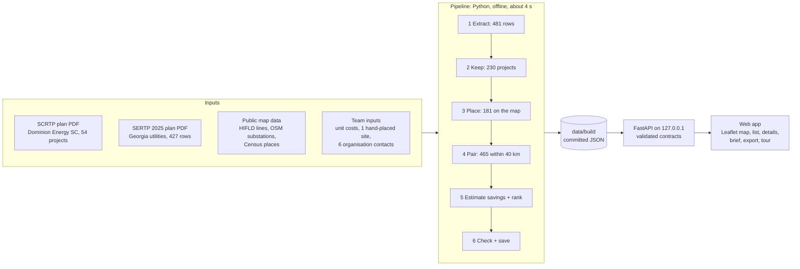

# How GridLock works: architecture and backend

GridLock has three parts, each with one job. A **Python pipeline** reads the two public plans and the public
map data once, offline, and saves checked files in `data/build/`. A **FastAPI server** on your own laptop
loads those files and answers the page. A **plain JavaScript web app** draws the map, the ranked list and
the details. Nothing needs the internet in normal use.



## 1. The pipeline (`pipeline/`)

One command, `python -m pipeline.build_all`, rebuilds everything the app shows in about four seconds.
Rebuilding from the same inputs gives byte-identical files, and the tests check that.

| Stage | Modules | What it does | Result |
| --- | --- | --- | --- |
| 1 Extract | `extract.py`, `ids.py`, `fields.py` | Turns both PDFs into rows. Names and descriptions are copied word for word, every row keeps its real PDF page, and IDs are derived from the source (`desc-p41` is page 41 of the Dominion plan). | 481 rows |
| 2 Keep | `build_all.py` | Keeps all Dominion projects and the SERTP projects in the Southern balancing area (the Georgia side). Every dropped row keeps its reason. | 230 projects (101 outside the area, 77 unlocated outside it, 69 outside Georgia and South Carolina, 4 PowerSouth) |
| 3 Place | `place_projects.py`, `hifld_routes.py`, `manual_locations.py` | Matches the substation names in each project to OpenStreetMap substations and to the named ends of HIFLD transmission lines. Draws real routes where one line joins both ends and plausible routes along the existing network where several do, falls back to a Census town centre flagged "town only", and never guesses. | 181 placed: 42 exact, 139 approximate; 49 unknown |
| 4 Pair | `find_overlaps.py`, `overlap_geometry.py` | For every two projects from different utilities, finds the nearest points in an equal-area projection (EPSG:5070) and measures the geodesic distance. Assigns the challenge's band and a touch reason (same substation, shared endpoint, same approximate area or nearby). | 465 pairs within 40 km |
| 5 Estimate + rank | `savings.py`, `find_overlaps.py` | Estimates what the two kinds of work could share at that distance from the team's unit-cost file, then scores every pair (below). | 119 savings ranges; rank 1 scores 5.823 |
| 6 Check + save | `build_all.py` | Adds the "Start here" places: the five Census places where touching, under 1.6 km and under 8 km pairs cluster, by the midpoint of each pair's nearest points. Validates every file against the data contracts in a temporary folder, then replaces `data/build/` all at once. | 7 files |

**Routes along existing lines** (`hifld_routes.py`). HIFLD lines form a graph whose nodes are line ends
within 100 m of each other. A route between two matched substations is used only when both are within
1.5 km of the network, it stays on the project's voltage class, it passes no other named substation, and it
is at most 1.5 times the straight distance. It stays labelled approximate.

**Savings** (`savings.py`). Each distance band unlocks items both jobs could share: outage and crossing
coordination when touching; land, access roads and permits under 1.6 km; laydown yards under 8 km; crew
and equipment moves under 40 km; bulk buying at any distance. An item counts only when both job types need
it. The low end keeps only items with a public precedent. Prices come from MISO's 2026 transmission cost
guide, brought to 2026 at 4% a year ([methodology](METHODOLOGY.md#how-savings-are-estimated)).

**Ranking.** `score = distance band × timing × location × state line × (1 + savings bonus)`:

| Part | Values |
| --- | --- |
| Distance band | touching 4, under 1.6 km 3, under 8 km 2, under 40 km 1 |
| Timing | same year 1.0, 1 year apart 0.7, 2 years 0.4, 3 or more 0.1, a year unknown 0.3 |
| Location | exact 1.0, approximate 0.8, for each project |
| State line | 1.5 when the projects are in different states |
| Savings bonus | 0 to 0.3 on a log scale: +0.15 at $100,000 of possible savings, +0.3 from $1,000,000 |

The bonus stops below the smallest step between two bands (4 to 3 is 33%), so with the other parts equal a
closer pair always ranks higher. Ties go to the shorter distance, then the ID.

## 2. Data contracts (`server/schemas.py`, `contracts/`)

Every file the pipeline writes and every API response is a Pydantic v2 model with `extra="forbid"`. The
models reject impossible states, both when the pipeline saves and when the server starts:

- A project with an unknown location has no geometry, and a placed project has an accuracy label. A
  "town only" project must be approximate.
- A pair's two IDs are sorted and canonical, its utilities differ, its band matches its distance (or the
  documented town-only cap), and its year gap matches the two years.
- A pair's score equals the product of its five stored parts (`score_parts`), and each part matches the
  pair's own band, years, accuracy, states and savings.
- A savings range has ordered bounds, a basis and its assumptions; any other status carries no numbers.

The JSON Schemas for all eight models are exported to `contracts/*.schema.json`, and a test fails if they
drift from the code.

## 3. The API (`server/`)

FastAPI and uvicorn on `127.0.0.1:8765`. The server loads `data/build/` once at start, read-only.

| Request | Returns |
| --- | --- |
| `GET /` | the GridLock page (static files under `/web`) |
| `GET /api/meta` | counts per pipeline stage, utility, accuracy and band; source documents |
| `GET /api/projects`, `/api/projects/{id}` | projects as GeoJSON, filterable by utility, voltage, years and project type |
| `GET /api/overlaps`, `/api/overlaps/{id}` | ranked pairs with the same filters plus band, cross-state and paging; one pair with both projects, savings and sources |
| `GET /api/search?q=` | places, projects and substations matching a name |
| `GET /api/area?lat=&lon=&radius_km=` | projects and pairs inside a circle of 1 to 80 km |
| `GET /api/briefs/{id}` | the coordination brief for a pair |
| `POST /api/briefs/{id}/generate` | an AI-drafted brief; off unless switched on, and guarded |
| `GET /api/export/overlaps.csv` | the filtered ranked list as a spreadsheet file |
| `GET /api/sources/{doc}` | the source plan PDF; the page's citation links open it at the cited page |
| `GET /api/map-config`, `/api/basemap`, `/basemap/gasc.pmtiles` | map options, the outline fallback map, the offline street map in byte ranges |
| `GET /api/storm/scenarios` | the hypothetical storm scenarios: the packaged track GL-1 and the synthetic storm |
| `GET /api/storm/estimate?scenario=synthetic&direction=&category=&lat=&lon=&radius_km=` | a hypothetical hurricane on a straight track through the area centre, from one of eight directions, Category 1 to 4, in hourly frames; the lines and substations inside the area with their peak wind, peak frame, illustrative damage chances and repair cost; P10/P50/P90 from 1,000 seeded draws; coverage; and a system-rule recommendation with evidence (`scenario=gl1` keeps the packaged track) |
| `GET /api/health` | a simple "the server is up" check |

A pair from `GET /api/overlaps/desc-p41__sertp-p107-9bc088` (trimmed):

```json
{
  "id": "desc-p41__sertp-p107-9bc088",
  "rank": 1,
  "score": 5.823,
  "score_parts": {"band": 4, "timing": 1.0, "location": 0.8, "state_line": 1.5, "savings": 1.2132},
  "distance_km": 0.0,
  "band": "touching",
  "touch_reason": "shared_endpoint",
  "timeline": "same year",
  "cross_state": true,
  "accuracy_pair": "approximate",
  "savings": {"status": "range", "low_usd": 62000, "high_usd": 264000}
}
```

Errors are short JSON, never stack traces: `GET /api/overlaps?band=nope` returns
`422 {"error": {"code": "invalid_request", "message": "Invalid request parameters"}}`.

## 4. Security and privacy

- **Loopback only.** The server listens on 127.0.0.1 and answers `400 invalid_host` to any other host name,
  which blocks DNS-rebinding tricks.
- **Content Security Policy** on every response: the page loads only its own files, plus Google's map hosts
  when the Google view is switched on with a key. Also `nosniff` and `no-referrer`.
- **Text, never HTML.** Every string from a PDF is inserted with `textContent`, and map tooltips get DOM
  nodes, so a project name cannot inject code.
- **Spreadsheet-safe CSV.** Cells that start with `=`, `+`, `-`, `@` or a control character are prefixed so
  a spreadsheet cannot run them as formulas.
- **Guarded AI briefs.** The generate route needs a custom header and an exact same-origin request, runs one
  at a time, stops after 5 per run and has a spending ceiling of $0 unless someone sets one. It is off by
  default, and every AI draft is labelled.
- **No secrets in the repository.** The optional Google key is read from a local file only when the Google
  view is switched on, and it is never logged or committed. A secrets scan runs before every push.

## 5. The web app (`web/`)

Plain HTML, CSS and JavaScript modules with no build step: Leaflet 1.9.4 for the map, protomaps-leaflet for
the offline street map (a 221 MB OpenStreetMap archive the server streams in byte ranges) and an optional
Google Maps or Satellite view. Light and dark themes, full keyboard use and a phone layout.

| Module (`web/js/`) | Job |
| --- | --- |
| `app.js`, `api.js`, `state.js`, `shell.js` | start the page, talk to the server, shared page state; the map-first layout (top bar, More menu, left list, right pane) |
| `map.js`, `basemap.js`, `nearest-geometry.js` | project shapes and pair highlight (zoom to the pair, thicker lines on a halo, the rank marker at the pair's nearest points, labels kept clear of the lines); street map, outline fallback, Google switch |
| `list.js` | the ranked pair list and the projects with no location |
| `overlap-detail.js`, `project-detail.js` | pair detail, including "How this pair ranks"; project detail in readable text |
| `search.js`, `filters.js`, `timeline.js`, `area.js` | search, filters, the year slider, explore an area (from a search result or the map's "Explore an area" button) |
| `start-here.js`, `impact.js` | the five "Start here" places (from `meta.json`); the one-line impact summary of the current results |
| `tracker.js` | the coordination tracker: a status and note per pair, saved in this browser, shown in the list and filled into print and CSV |
| `brief.js`, `ai-brief-example.js`, `export.js` | coordination brief and the Claude API example; CSV export and print report |
| `tour.js`, `tour-content.js` | the 12-step guided tour; every tour word lives in one file |
| `storm.js`, `storm-animation.js`, `storm-detail.js` | the storm preview: direction and category controls in the area panel; the hurricane forming, crossing the area and lighting up exposed assets at their peak hour (Pause, Replay, Skip, reduced motion); the results in the right pane |

The storm engine is in `server/storm/`: a Holland (1980) wind field on the hourly track, illustrative lognormal
fragility curves by asset class, repair ratios on the team's unit costs, and 1,000 Monte Carlo draws with seed
42 that vary storm pressure, track offset and fragility. Everything it returns is labelled hypothetical or
illustrative; [RESILIENCE_LAB_PLAN.md](RESILIENCE_LAB_PLAN.md) has the formulas and the full plan.

## 6. Coordination briefs

Each pair can show a brief: what, where, when, what could be shared, the savings range, which organisations
to contact, caveats and sources. By default it is a **Template** brief written by code from the pair's data
(`server/brief_template.py`), so it is the same every time and needs no internet. The page leads with the
next step and what to check first, and folds away the facts the pair detail already shows.

The **AI-drafted brief** path is built and guarded but off: `server/brief_generator.py` sends the pair's data to
Claude with fixed rules, validates the answer against the Brief contract and grades it before caching it. It
needs a Claude API key and a spending limit. The brief panel's "With the Claude API" card explains what it
adds and shows an example for pair #1 (`web/js/ai-brief-example.js`). Claude wrote the example outside the app
under the same rules, and `tests/eval/test_grader.py` checks it with the live grader. A grader
(`tests/eval/grader.py`) checks every brief:

- It must be 150 to 300 words and state both in-service years, or say a year is unknown.
- Every dollar amount, page and number must come from the pair's own data.
- Contacts must be the pair's two organisations from the committed list, never a person's name, email or
  phone.
- It must cite both source documents with pages, label a savings range as an estimate, and carry a checking
  caveat for approximate locations.
- Instructions found in source text must never reach the brief.

## 7. Tests

`VERIFY.cmd` (or `scripts/verify.ps1`) compiles the Python code and runs every suite with no skips allowed;
it fails if the number of passing tests drops below the recorded baseline.

| Suite | What it checks |
| --- | --- |
| `tests/pipeline` (14 files) | extraction, IDs, bands and boundaries, placement rules, routes, savings, scores, contracts, byte-identical rebuilds, named examples |
| `tests/api` (8 files) | every route, filters, errors, search, area, CSV export, briefs, the storm estimate (track through the centre, direction and category, determinism, validation) and the security guards |
| `tests/eval` | the brief grader against a labelled set of real pairs |
| `tests/e2e` (22 files, plus the audit matrix) | the page in Chromium with Playwright: demo path, the map-first layout, details, tour, filters, timeline, area, the storm animation and its results, export and print, offline map, phone layout, and axe-core accessibility audits in light and dark |

## 8. How it was built

A two-agent build during ShellHacks 2026. Claude (Opus) wrote the spec, the task list, the data contracts
and the design direction with the team. A Codex lead (`gpt-6-sol`) built the app in parallel lanes, each a
sub-agent in its own git worktree behind a quick test gate, and ran two judging rounds with separate judge
agents. Claude then reviewed the delivered build: routes along existing lines and "town only" flags,
savings by job type and distance in the ranking, the score breakdown on every pair, a tour written for
judges, and a UI polish pass. The build records are in [`reviews/`](../reviews/2026-09-26-gridlock-build/).
