# GridLock in screenshots

A walk through every feature, in the order a planner or a judge would use them. Every picture comes from
the committed data. [`scripts/capture_screenshots.py`](../scripts/capture_screenshots.py) re-creates them, and
`START` then **Take the tour** shows the same path live.

## 1. The map and the ranked list

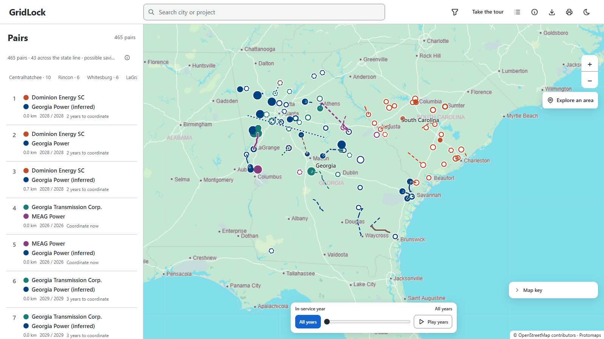

The 230 projects from Dominion Energy SC's plan and the Georgia utilities' SERTP plan, each in its utility's
colour.
Solid lines are exact routes, dashed lines are approximate, and projects with no known location stay in the
list instead of being guessed. The list ranks all 465 pairs of projects from different utilities that are
within 40 km of each other.

## 2. The tour explains the score

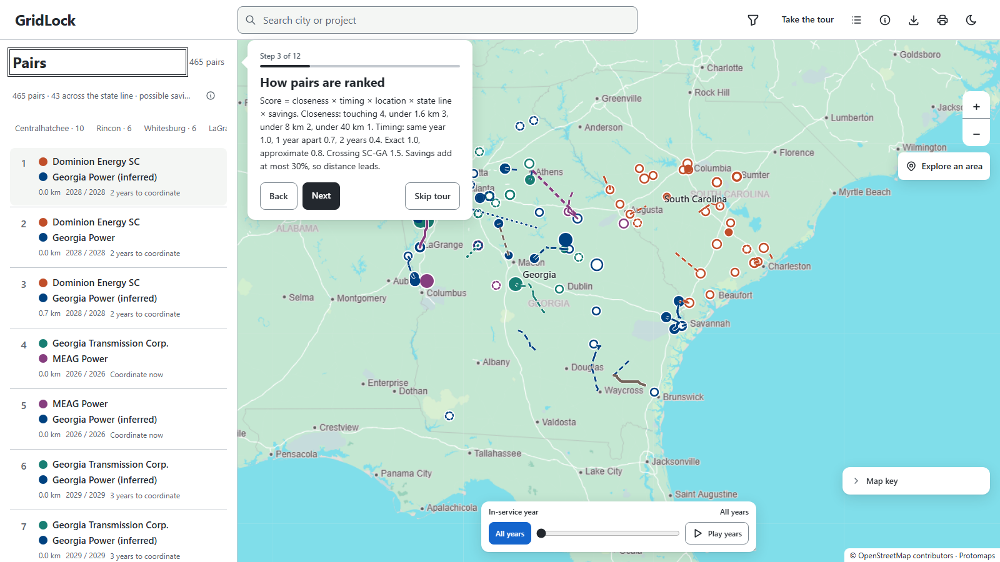

**Take the tour** walks through the app in 12 short steps written for a first-time visitor. This step gives
the whole ranking formula with its numbers.

## 3. Start from a place

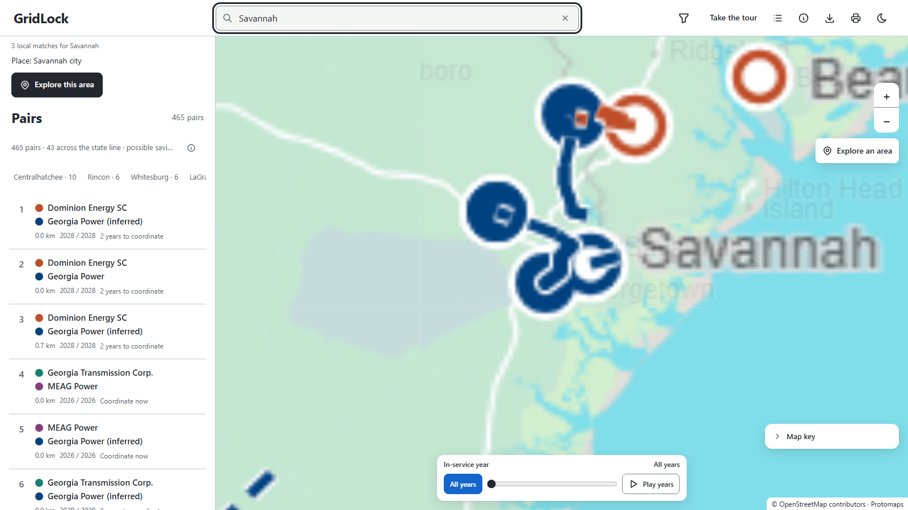

Planners start from a place. Search a city, project or substation; choosing a result moves the map.

## 4. Open the top pair

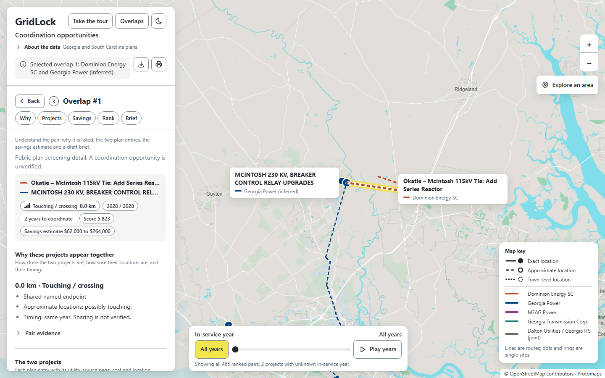

The pair is highlighted on the map, and the detail says why the two projects appear together: here, both
plans name McIntosh, both projects enter service in 2028, and one is in South Carolina and the other in
Georgia. The
detail also says what is not known: the plans do not show shared work.

## 5. Every fact has a source

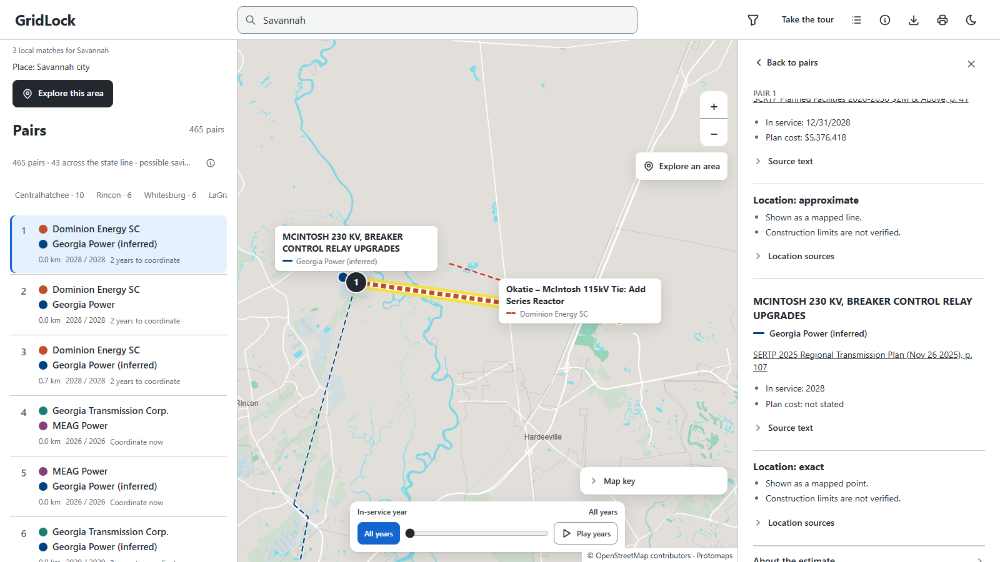

Each project shows its plan document and PDF page as a link, with names copied word for word. Its location
accuracy (exact, approximate or unknown) is stated in words, with the sources behind it.

## 6. Possible savings by job type and distance

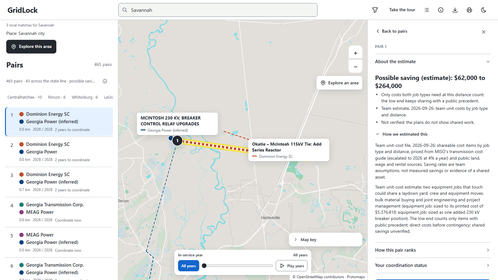

The closer two projects are, the more they could share: crews and equipment within 40 km, laydown yards
within 8 km, land and access roads within 1.6 km, outages and crossings when touching. GridLock counts only
the costs both kinds of work need, prices them from the team's 2026 unit costs and shows a range. The low end
keeps only items with a public precedent. It is an estimate, and it is labelled as one.

## 7. Why a pair ranks where it does

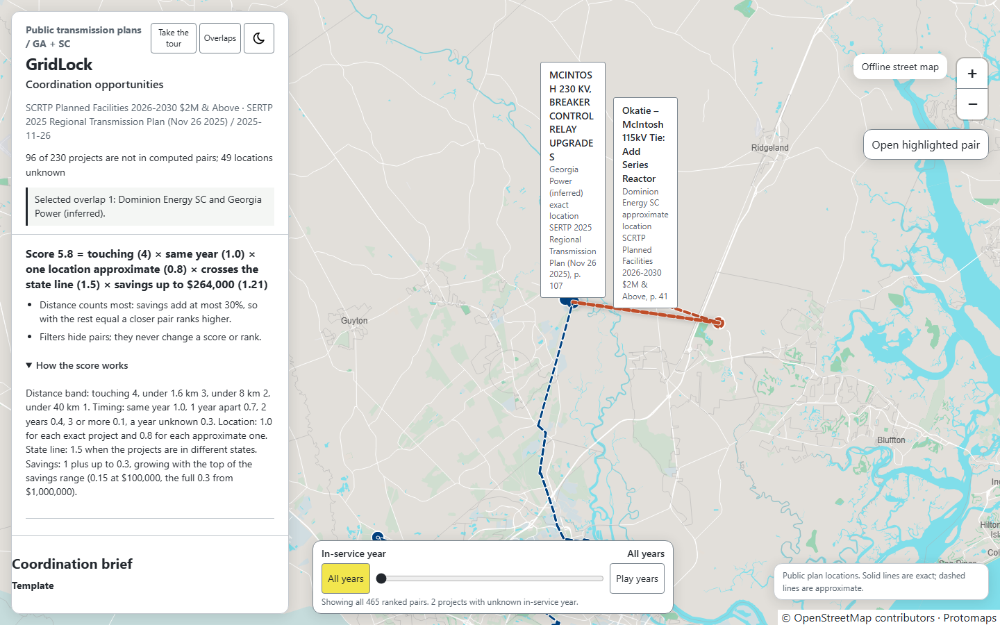

Every pair ends with its score, factor by factor, so any rank can be checked by hand. Distance counts most:
savings can add at most 30%, less than the step between two distance bands.

## 8. A coordination brief

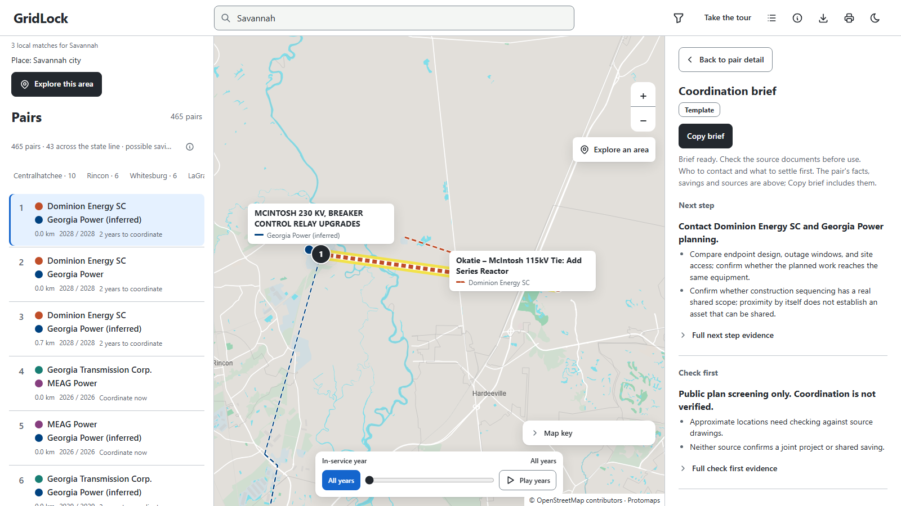

The brief does not repeat the pair's facts. It starts with the **next step** (which organisations to contact
and what to compare) and what to **check first**, and keeps the shared facts folded away so **Copy brief** still
gives a complete note. It is labelled **Template** (written by code) and names organisations, never people.
The **With the Claude API** card shows what an AI-drafted brief adds. For pair #1 it includes an example
written by Claude from the pair's data and passed by the same evidence grader the live feature uses. The live
feature is off in this build because it needs an API key and a spending limit.

## 9. Compare years

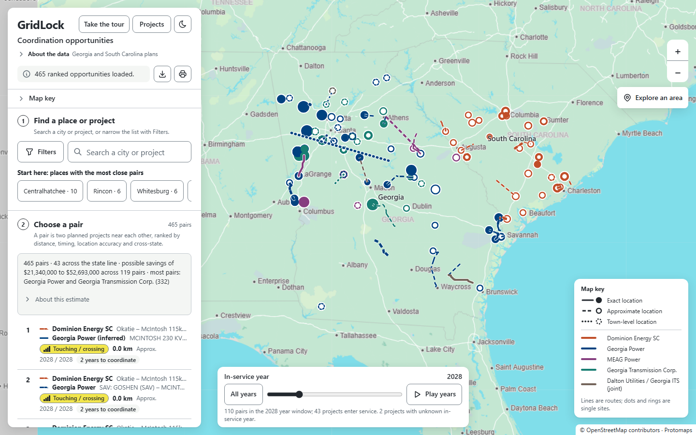

Timing is the second signal. The slider highlights what enters service in a given year, or **Play years**
steps through them.

## 10. Narrow the results

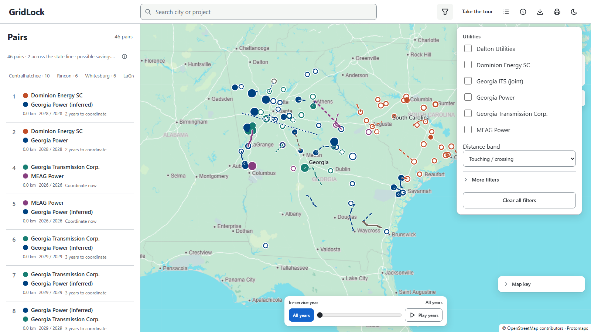

Filter by utility and distance band; **More filters** adds voltage, project type and years. A pair stays only
when both of its projects pass.

## 11. Explore an area

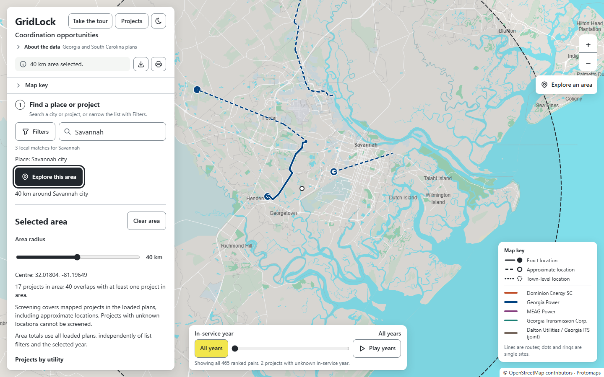

Choose a place and **Explore this area** to list every project and pair inside a circle you can resize from
1 to 80 km.

## 12. Routes along existing lines

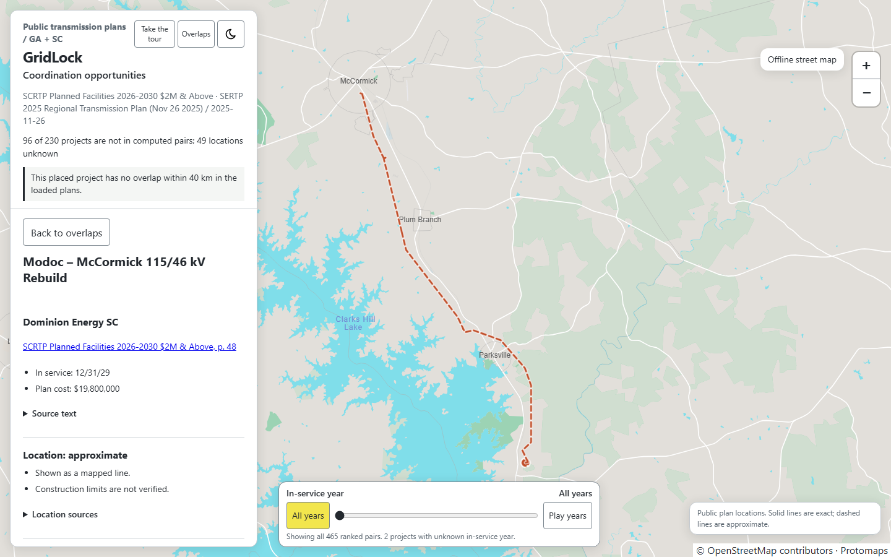

The plans name a line's end substations but not its route. When the existing HIFLD network connects the two
ends plausibly (same voltage class, no other named substation on the way, at most 1.5 times the straight
distance), GridLock follows it instead of drawing a straight line. It stays labelled approximate.

## 13. Town-only locations are flagged

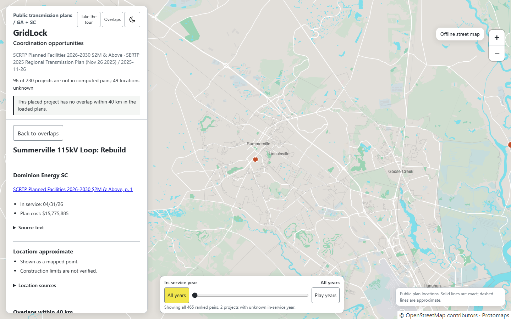

When no substation matches, a project sits at its Census town centre and is flagged "town only". Such a
location can never put a pair closer than "under 40 km" unless both plans name the same substation.

## 14. Legend, export and print

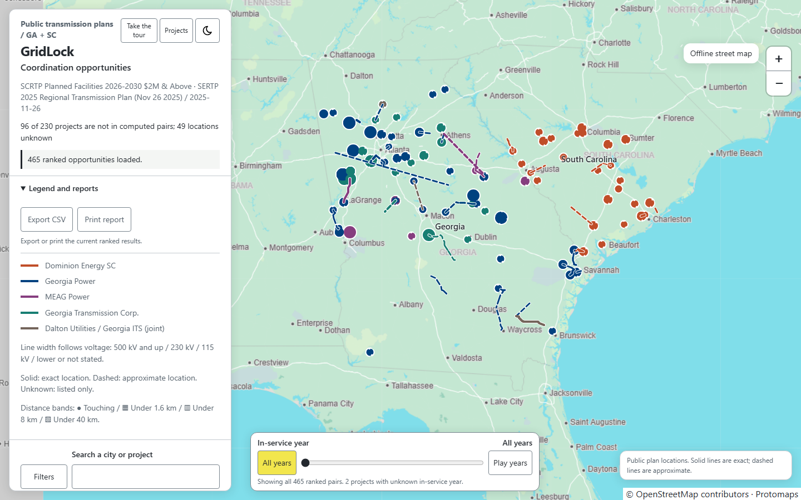

**Export CSV** saves the ranked list you are looking at, laid out like a utility conflict matrix. **Print
report** makes a Letter report with sources; here is [a sample for the touching pairs](sample-report.pdf).

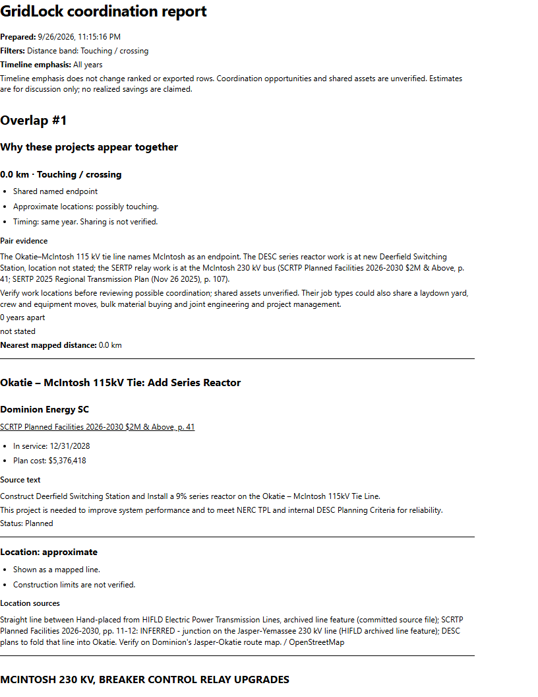

## 15. Dark theme and phones

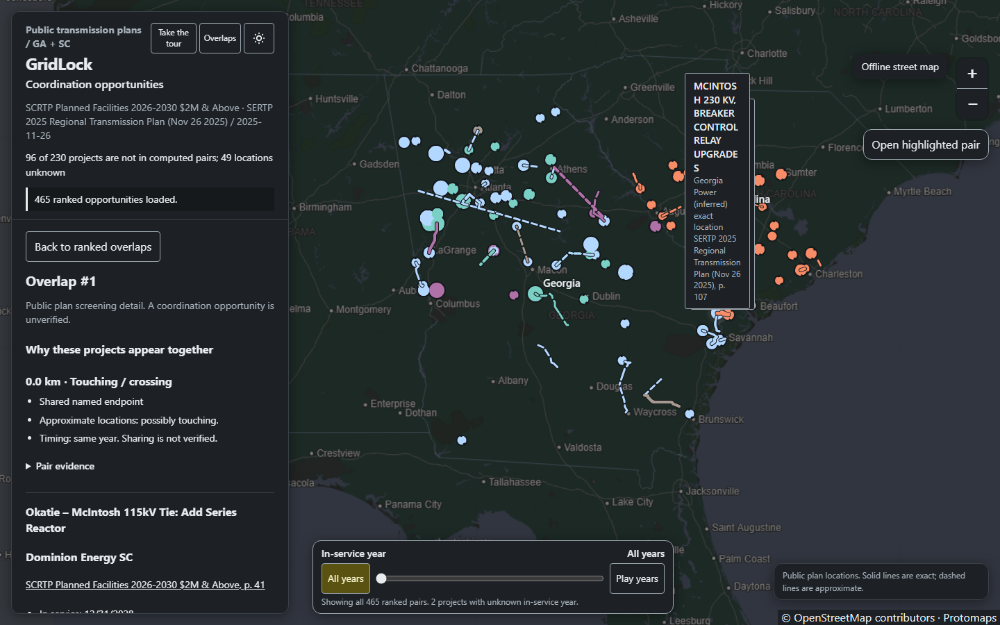

| Phone: ranked list | Phone: pair detail |
| --- | --- |
| 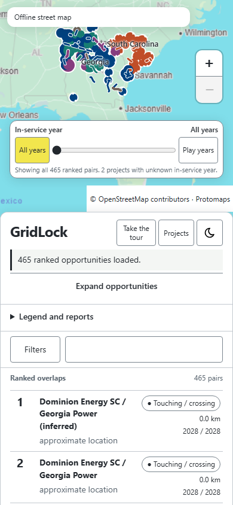 | 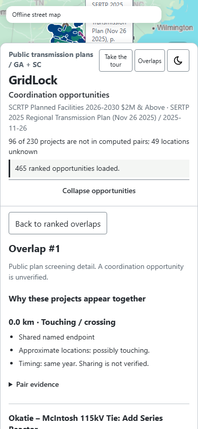 |

Light and dark themes, full keyboard use and a phone layout, checked with automated accessibility audits.

For what happens behind the page (the pipeline, data contracts, API, security and tests), see
[ARCHITECTURE.md](ARCHITECTURE.md). For the exact rules, see [METHODOLOGY.md](METHODOLOGY.md).
