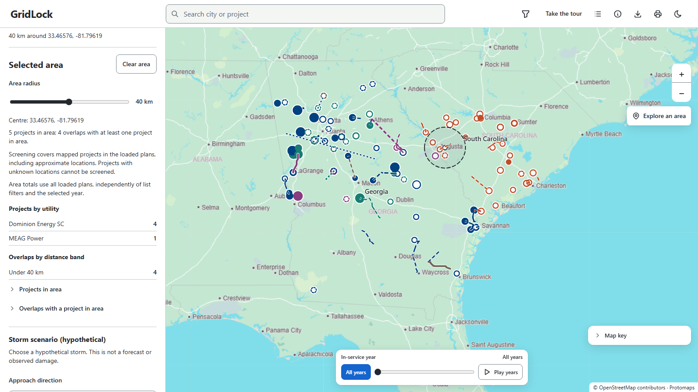
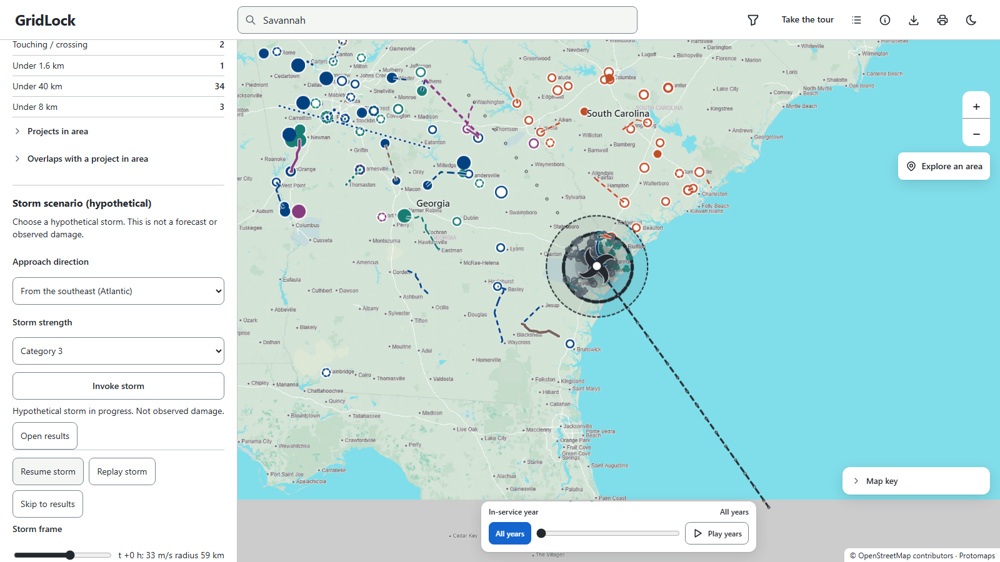
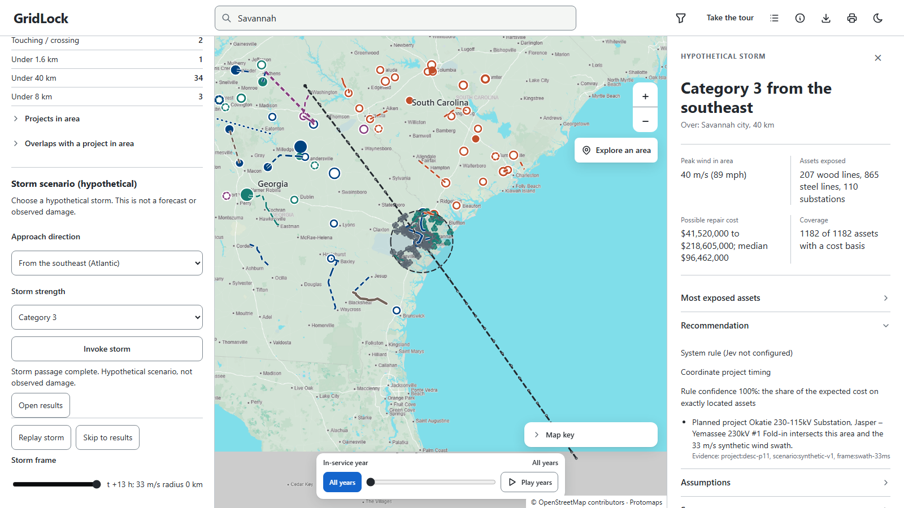
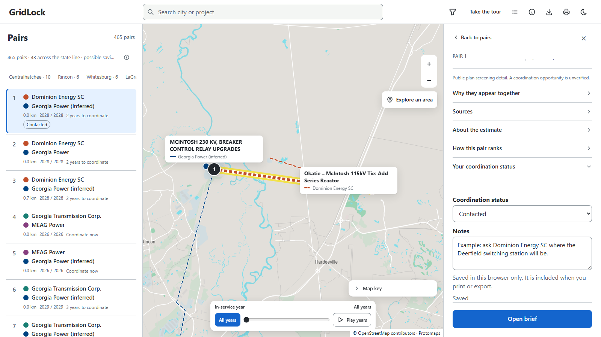

# GridLock in screenshots

A walk through every feature, in the order a planner or a judge would use them. Every picture comes from
the committed data. [`scripts/capture_screenshots.py`](../scripts/capture_screenshots.py) re-creates them, and
`START` then **Take the tour** in the top bar shows the same path live.

## 1. The map and the ranked list

The map is the centre of the page: the ranked pairs on the left, the selected pair on the right. It shows the
230 projects from Dominion Energy SC's plan and the Georgia utilities' SERTP plan, each in its utility's colour.
Solid lines are exact routes, dashed lines are approximate, and projects with no known location stay in the
list instead of being guessed. The list ranks all 465 pairs of projects from different utilities that are
within 40 km of each other. **Map key**, at the bottom of the map, unfolds the line styles and colours.

## 2. The tour explains the score

**Take the tour** (in the top bar, or under **⋮** on narrower screens) walks through the app in 12 short steps
written for a first-time visitor. This step gives the whole ranking formula with its numbers.

## 3. Start from a place

Planners start from a place. Search a city, project or substation in the top bar; choosing a result moves the
map.

New here? **Start here** offers the five places where close pairs cluster, such as Rincon, next to the
McIntosh pairs. One click opens a 10 km area there. The list header sums up the current results: how many
pairs there are, how many cross the state line, the possible savings across the pairs with an estimate, and
which utilities overlap most. It changes with the filters.

## 4. Open the top pair

The map zooms to the pair: its two lines get thicker, sit on a bright halo and carry the pair's rank, while the
other lines get thinner. The right pane gives the facts at a glance (proximity, distance, years, coordination
window, score, possible saving), and each detail folds behind a heading: **Why they appear together**,
**Sources**, **About the estimate** and **How this pair ranks**. Here both plans name McIntosh, both projects
enter service in 2028, and one is in South Carolina and the other in Georgia. The detail also says what is not
known: the plans do not show shared work.

## 5. Every fact has a source

**Sources** shows each project's plan document and PDF page as a link, with names copied word for word. Its
location accuracy (exact, approximate or unknown) is stated in words, with the sources behind it.

## 6. Possible savings by job type and distance

The closer two projects are, the more they could share: crews and equipment within 40 km, laydown yards
within 8 km, land and access roads within 1.6 km, outages and crossings when touching. GridLock counts only
the costs both kinds of work need, prices them from the team's 2026 unit costs and shows a range. The low end
keeps only items with a public precedent. It is an estimate, and it is labelled as one.

## 7. Why a pair ranks where it does

**How this pair ranks** gives the score factor by factor, so any rank can be checked by hand. Distance counts
most: savings can add at most 30%, less than the step between two distance bands.

## 8. A coordination brief

**Open brief** shows the brief in the same pane. It does not repeat the pair's facts. It starts with the
**next step** (which organisations to contact and what to compare) and what to **check first**, and keeps the
shared facts folded away so **Copy brief** still gives a complete note. It is labelled **Template** (written by
code) and names organisations, never people. The **With the Claude API** card shows what an AI-drafted brief
adds. For pair #1 it includes an example written by Claude from the pair's data and passed by the same
evidence grader the live feature uses. The live feature is off in this build because it needs an API key and a
spending limit.

## 9. Compare years

Timing is the second signal. The slider at the bottom of the map highlights what enters service in a given
year, or **Play years** steps through them.

## 10. Narrow the results

The filter button in the top bar filters by utility and distance band; **More filters** adds voltage, project
type and years. A pair stays only when both of its projects pass.

## 11. Explore an area

Choose a place and **Explore this area** to list every project and pair inside a circle you can resize from
1 to 80 km. On the map, the **Explore an area** button does the same for any point. Switch it on, then click
the map; a plain map click never drops a circle.

## 12. Invoke a storm over an area (Resilience Lab preview)

With an area open, choose where the storm comes from (southeast by default, or the Gulf, or any of eight
directions) and its category (1 to 4), then press **Invoke storm**. A hypothetical hurricane forms at sea, spins
along its track and crosses the area. Each line or substation inside the circle changes to its damage class
(pattern and colour) when the storm's peak wind reaches it. **Pause storm**, **Replay storm** and **Skip to
results** control the playback; with reduced motion the final state appears at once.

The right pane then gives the storm's results: the peak wind in the area and the assets exposed, the possible
repair cost from P10 to P90 with the median (1,000 seeded draws), how many assets have a cost basis, the most
exposed assets with their sources, and a recommendation from a system rule with its evidence, marked
**Requires human review** when the evidence is thin. The storm track, the damage curves and the repair ratios
are hypothetical or illustrative: this is a planning exercise, not a forecast or observed damage. The full plan
is in [RESILIENCE_LAB_PLAN.md](RESILIENCE_LAB_PLAN.md).

## 13. Track the coordination

For each pair, **Your coordination status** records where the conversation stands (Contacted, Meeting set,
Coordinating or Not relevant) and a short note. It is saved only in this browser, shows as a tag in the ranked
list, and fills the Coordination status and Notes columns when you print or export.

## 14. Routes along existing lines

The plans name a line's end substations but not its route. When the existing HIFLD network connects the two
ends plausibly (same voltage class, no other named substation on the way, at most 1.5 times the straight
distance), GridLock follows it instead of drawing a straight line. It stays labelled approximate.

## 15. Town-only locations are flagged

When no substation matches, a project sits at its Census town centre and is flagged "town only". Such a
location can never put a pair closer than "under 40 km" unless both plans name the same substation.

## 16. Legend, export and print

Beside the filter, the top bar has **Take the tour** and one icon per action (hover for its name): Projects, About
the data, Export CSV, Print report and the theme switch; on narrower screens they fold into the **⋮** menu. **Map key**
sits on the map. **Export CSV**
saves the ranked pairs you are looking at for Excel, with only the key columns: rank and score; each project's
utility, name and in-service year; distance and proximity; years to coordinate; whether the pair crosses the
state line; the possible saving as low and high numbers (blank when there is no estimate); location accuracy;
each project's plan document and page; and your coordination status and notes. **Print report** makes a clean
Letter report: a header with the plan editions and filters, four key figures, the selected pair on one card, the
ranked pairs in a table with their sources, and the sources and notes. Filter first for a short report; here is
[a sample for the touching pairs](sample-report.pdf).

## 17. Dark theme and phones

| Phone: ranked list | Phone: pair detail |
| --- | --- |
|  |  |

Light and dark themes, full keyboard use and a phone layout, checked with automated accessibility audits.

For what happens behind the page (the pipeline, data contracts, API, security and tests), see
[ARCHITECTURE.md](ARCHITECTURE.md). For the exact rules, see [METHODOLOGY.md](METHODOLOGY.md).
